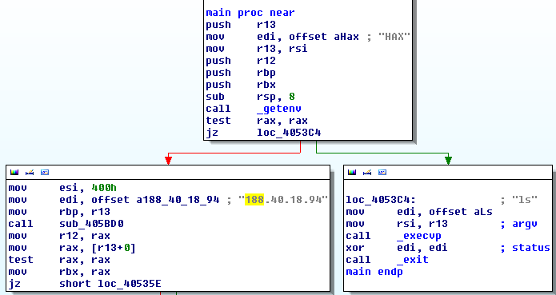

LS
===

> we found this [binary](ls) and captured some [traffic](ls.pcap)...

## Write-up

I started off with inspecting the captured traffic which looked like a tcp connection to 188.40.18.94 sending some binary data back and forth. I couldn't really make anything from it.

So off to the binary. Looking at the main function in IDA we immediatly see two branches. 



If the environment variable "HAX" exists the program executes sub_405BD0("188.40.18.94", 1024) which seems like setting up a connection to the ip also found in the pcap.
Running a quick strace we confirm that it indeed makes this connection

```bash
$ export HAX=hax
$ strace ./ls
	...
	socket(PF_INET, SOCK_STREAM, IPPROTO_TCP) = 6
	connect(6, {sa_family=AF_INET, sin_port=htons(1024), sin_addr=inet_addr("188.40.18.94")}, 16) = 0
	...
```